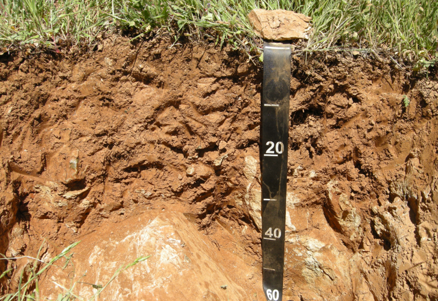

class: titleSlide
<br><br><br>
.pull-left[
  ## Enhancing Accuracy and Applicability of U.S. Soil Taxonomy
  <br><br><br>
  #### SSSA 2020 -- Future of Pedology Symposium 
]

.right[.large[<br><br><br><br><br><br><br><br>
Andrew G. Brown<br>
<a href="mailto:andrew.g.brown@usda.gov">`r icon::fa("mail-bulk")`&nbsp;andrew.g.brown@usda.gov</a>
<br><br>
Dr. Dylan E. Beaudette</b><br>
<a href="mailto:dylan.beaudette@usda.gov">`r icon::fa("mail-bulk")`&nbsp;dylan.beaudette@usda.gov</a><br><br>

]]

<!--
title: "Enhancing Accuracy and Applicability of U.S. Soil Taxonomy"
author: "Andrew G. Brown & Dylan E. Beaudette"
date: "SSSA -- Future of Pedology - November 2020"

Abstract:

Pedologic knowledge has been hard won through the work of countless soil and earth scientists. This knowledge been distilled into standards and classification systems that allow us to consistently reason over diverse and complex natural systems. As new needs arise and knowledge is gained, criteria for classification and separation of concepts are refined and historic criteria are called in to question. Determining potential impacts of new or altered criteria throughout a classification system is complicated and time-consuming – perfect for the application of computer-aided reasoning. However, soils data and soil classification systems, particularly U.S. Soil Taxonomy, have nuances that require careful consideration.

Changes to criteria that affect fundamental diagnostic features in Soil Taxonomy can have large influences on classification and, by association, grouping of soil concepts that are similar for use and management in soil surveys. We have developed data structures and computer code in the R package “aqp," or Algorithms for Quantitative Pedology, that are capable of reasoning over soil profile data and criteria. This implementation of concepts has offered novel opportunities for data-driven analyses relating properties (predicted or observed) to taxonomic or interpretive groups. Routines for programmatic identification of soil features such as argillic horizons and mollic epipedons are a fundamental steps towards automated classification using U.S. Soil Taxonomy.
-->


---
class: bodySlide
<br>
# Who am I?

.left-column[


]

.right-column[
#### Andrew G. Brown
 - Soil Scientist in _Sonora, CA_, Southwest Soil Survey Region
 
 - Area of responsibility: Sierra Nevada Foothills & Mountains (MLRAs 18 & 22A)
 
 - Western Region National Cooperative Soil Survey (NCSS) Standards Committee (2018, 2020)
 
 - Contributor to _Algorithms for Quantitative Pedology_ Project (http://ncss-tech.github.io/AQP/)
]

---
class: bodySlideNOBR
<br>

## The _Keys to Soil Taxonomy_ are like a set of sieves

.left-column[

]

<span>&nbsp;&nbsp;&nbsp;KST Lookup: https://brownag.shinyapps.io/KSTLookup<br></span>
<span>&nbsp;&nbsp;&nbsp;KST Preceding Taxa: https://brownag.shinyapps.io/KSTPreceding<br></span>

--

.right-column[

]

---
class: bodySlideNOBR
<br>

## The _Keys to Soil Taxonomy_ are like a set of sieves

<span>&nbsp;&nbsp;&nbsp;KST Lookup: https://brownag.shinyapps.io/KSTLookup<br></span>
<span>&nbsp;&nbsp;&nbsp;KST Preceding Taxa: https://brownag.shinyapps.io/KSTPreceding<br></span>


??? 

The 7th Approximation to Today -- a theoretical framework

  
---
class: bodySlideNOBR
<br>

## Diagnostic Features & Properties

.pull-left[

]

.pull-right[
```{r, echo = FALSE}
library(kableExtra)
diag <- read.csv("subgrp_diag_counts_table.csv")
#knitr::kable(diag, row.names = FALSE, )
column_spec(kable_classic(kbl(diag, 
                              caption = "Times Used in Order - Subgroup Level Keys"), 
                          full_width = F), 2, background="white")
```
]

???
 
Diagnostic features and properties are the heart of soil taxonomy. These features are identified based on field and laboratory observations that are related to the _process_ of pedogenesis.

---
class: bodySlide
<br>

## Soil v.s. Non-soil & Soil Depth

> _“The lower boundary that separates soil from the nonsoil underneath is most difficult to define_
> ...
> In some instances the more weakly cemented bedrocks ... have been described below the lower boundary of soil and used to differentiate soil series (series control section, defined in chapter 17). This is permissible even though the paralithic materials below a paralithic contact are not considered soil in the true sense.” (KST, p. 1)

<table border=0>
<tr> 
<td></td>
<td></td>
<td></td>
</tr>
</table>

???

In Sonora, with the wide variety of parent materials we have, we need to pay close attention to series control sections and criteria related to bedrock contacts.

Historic concepts are often inadequate to constrain a series concept to a single taxonomic family. This poses a correlation problem for update work involving older series. Older series with large extent generally are more broadly defined, due to changes in taxonomy / concepts / mapping standards over time. 

What are the factors affecting the bedrock cementation in a set of related components?

 - Regional climatic patterns?
 - Geologic formation / member?
 - Local terrain / age of surface / hydrology? 
 - Something else – incomplete or inconsistent descriptions?

---
class: bodySlide
<br>
## Texas Densics

---
class: bodySlide
<br>
## Soil Age & Time 

???

Jenny (1941) and others have questioned at what point a parent material becomes "soil". On the other side of the spectrum, we have the question of at what point a soil becomes a "paleosol" -- a soil formed under a different suite of conditions. Between these two extremes, we have many shades of gray -- these are local considerations that Soil Survey Staff have spent many years carefully documenting.

Additions, translocations, removals drive the favorability of different reactions, the mobility of constituents and more. Accumulations and depletions, in general, are essential to gathering "evidence" about soil forming process and therefore tie in deeply with the definitions of our diagnostic features. The process itself is not what is important, but rather the evidence of that process. This way, if our process understanding improves or changes, we still have fundamental physical observations that can be re-correlated under the new understanding.

The concept that "soils are clay factories" essentially says that given enough time and stability, we will start to see accumulations of secondary weathering products from parent material -- this "accumulation" is the essence of the argillic horizon, which was the third item on our list. 

---
class: bodySlide
<br>
## The Argillic Horizon
#### Cohasset pedon example
.left-column[
```{r, echo=FALSE, message =  FALSE, fig.width=4.5, fig.height=12}
par(mar = c(0,0,0,6))
library(aqp)
library(soilDB)
f <- fetchKSSL('cohasset', returnMorphologicData = TRUE, simplifyColors = TRUE)
f <- f$SPC[7,]
 
m <- get.increase.matrix(f, 'clay', crit.clay.argillic, 30)
d <- get.increase.depths(f, 'clay', crit.clay.argillic, 30)[1]
row.names(m) <- round(f$clay,1)
colnames(m) <- round(f$clay,1)

plot(f, color = "moist_soil_color", cex.names = 2.6, print.id = FALSE, axis.line.offset = -2.25)
abline(h = d, lty = 2)
```
]

.right-column[

.center[
#### Laboratory measured clay content (%), "increase matrix"
```{r, echo=FALSE}
m
```
]

- Argillic & Particle Size Control Section start at `r paste0(d,'cm')`

- Horizon #4 meets the clay increase requirement relative to #1, #2 and #3, but increase occurs _within a vertical distance_ of only #3.

]

---
class: bodySlide
<br>

## The Soil Surface

---
class: bodySlideNOBR
## The Mollic Epipedon

.top[]

---
class: bodySlideNOBR
<br>
## The Mollic Epipedon

.center[
```{r, echo=FALSE, message=FALSE, warning=FALSE}
par(mar=c(0,0,0,8))
load(file="img/tama.Rda")
tama$SPC$mollicthk <- profileApply(tama$SPC, mollic.thickness.requirement, clay.attr = 'clay')
tama$SPC$is_mollic_color <- hasDarkColors(tama$SPC, d_value = NA)
horizons(tama$SPC)$is_mollic_mask <- rgb(0,0,0)
horizons(tama$SPC)$is_mollic_mask[!tama$SPC$is_mollic_color] <- rgb(1,1,1)

# addDiagnosticBracket(tama$SPC, kind = 'particle size control section', lwd=3)
# addDiagnosticBracket(tama$SPC, kind = 'minimum mollic/umbric thickness', lwd=3,
#                      offset=0, tick.length=0, col="green")

tama2 <- harmonize(tama$SPC, list(mollic = list(moist_color = "moist_soil_color", 
                                                is_mollic_color = "is_mollic_mask")))
```
```{r, echo=FALSE, fig.width=20, fig.height=15, message=F, warning=F}
groupedProfilePlot(tama2[11:18,], name.style = "left-center",
                   groups = "hgroup", color = "mollic", 
                   cex.names = 2.4, group.name.cex = 2.4)
```
]
---
class: bodySlideNOBR
<br>

## The Mollic Epipedon

.center[
```{r, echo=FALSE, message=FALSE, warning=FALSE}
par(mar=c(0,0,0,12))
load(file="img/tama.Rda")
tama$SPC$mollicthk <- profileApply(tama$SPC, mollic.thickness.requirement, clay.attr = 'clay')
tama$SPC$is_mollic_color <- hasDarkColors(tama$SPC, d_value = NA)
horizons(tama$SPC)$is_mollic_mask <- rgb(0,0,0)
horizons(tama$SPC)$is_mollic_mask[!tama$SPC$is_mollic_color] <- rgb(1,1,1)

# addDiagnosticBracket(tama$SPC, kind = 'particle size control section', lwd=3)
# addDiagnosticBracket(tama$SPC, kind = 'minimum mollic/umbric thickness', lwd=3,
#                      offset=0, tick.length=0, col="green")

tama2 <- harmonize(tama$SPC, list(mollic = list(moist_color = "moist_soil_color", 
                                                is_mollic_color = "is_mollic_mask")))
```
```{r, echo=FALSE, fig.width=20, fig.height=15, message=F, warning=F}
groupedProfilePlot(tama2[11:18,], name.style = "left-center",
                   groups = "hgroup", color = "mollic", 
                   cex.names = 2.4, group.name.cex = 2.4)
```
]

---
class: bodySlide
<br>
## Soil Series

---
class: bodySlide
<br>
## Future of Soil Taxonomy


---

## Impacts on Soil Mapping


