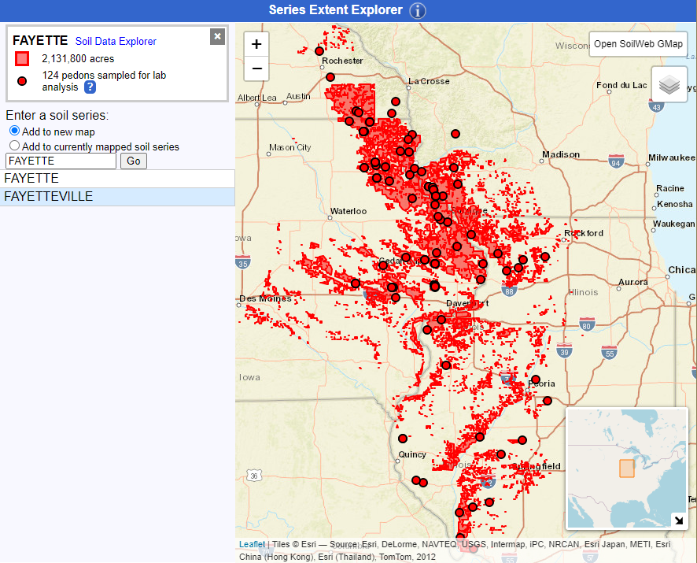

class: titleSlide
<br><br><br>
.pull-left[
  ## Enhancing Accuracy and Applicability of U.S. Soil Taxonomy
  <br><br><br>
  #### SSSA 2020 &mdash; Future of Pedology Symposium 
]

.right[.large[<br><br><br><br><br><br><br><br>
Andrew G. Brown<br>
<a href="mailto:andrew.g.brown@usda.gov">`r icon::fa("mail-bulk")`&nbsp;andrew.g.brown@usda.gov</a>
<br><br>
Dylan E. Beaudette</b><br>
<a href="mailto:dylan.beaudette@usda.gov">`r icon::fa("mail-bulk")`&nbsp;dylan.beaudette@usda.gov</a><br><br>

]]

<!--
title: "Enhancing Accuracy and Applicability of U.S. Soil Taxonomy"
author: "Andrew G. Brown & Dylan E. Beaudette"
date: "SSSA -- Future of Pedology - November 2020"

Abstract:

Pedologic knowledge has been hard won through the work of countless soil and earth scientists. This knowledge been distilled into standards and classification systems that allow us to consistently reason over diverse and complex natural systems. As new needs arise and knowledge is gained, criteria for classification and separation of concepts are refined and historic criteria are called in to question. Determining potential impacts of new or altered criteria throughout a classification system is complicated and time-consuming – perfect for the application of computer-aided reasoning. However, soils data and soil classification systems, particularly U.S. Soil Taxonomy, have nuances that require careful consideration.

Changes to criteria that affect fundamental diagnostic features in Soil Taxonomy can have large influences on classification and, by association, grouping of soil concepts that are similar for use and management in soil surveys. We have developed data structures and computer code in the R package “aqp," or Algorithms for Quantitative Pedology, that are capable of reasoning over soil profile data and criteria. This implementation of concepts has offered novel opportunities for data-driven analyses relating properties (predicted or observed) to taxonomic or interpretive groups. Routines for programmatic identification of soil features such as Argillic Horizons and Mollic Epipedons are a fundamental steps towards automated classification using U.S. Soil Taxonomy.
-->

```{r setup, echo = FALSE}
knitr::opts_chunk$set(fig.retina = 3, warning = FALSE, message = FALSE)
```

---
class: bodySlide
<br>
# Who am I?

.left-column[


]

.right-column[
#### Andrew G. Brown
 - Soil Scientist in Sonora, CA, Southwest Soil Survey Region
 
 - Area of responsibility: Sierra Nevada Foothills & Mountains (MLRAs 18 & 22A)
 
 - Western Region National Cooperative Soil Survey (NCSS) Standards Committee (2018, 2020)
 
 - Contributor to _Algorithms for Quantitative Pedology_ Project (http://ncss-tech.github.io/AQP/)
]

---
class: bodySlideNOBR
<br>

## The _Keys to Soil Taxonomy_ are like a set of sieves

<span>&nbsp;&nbsp;&nbsp;&nbsp;KST Lookup App: https://brownag.shinyapps.io/KSTLookup<br></span>
<span>&nbsp;&nbsp;&nbsp;&nbsp;KST Preceding Taxa App: https://brownag.shinyapps.io/KSTPreceding<br></span>

.top[

]

---
class: bodySlideNOBR
<br>

## The _Keys to Soil Taxonomy_ are like a set of sieves


<span>&nbsp;&nbsp;&nbsp;&nbsp;KST Lookup App: https://brownag.shinyapps.io/KSTLookup<br></span>
<span>&nbsp;&nbsp;&nbsp;&nbsp;KST Preceding Taxa App: https://brownag.shinyapps.io/KSTPreceding<br></span>


---
class: bodySlideNOBR
<br>

## The _Keys to Soil Taxonomy_ are like a set of sieves

<span>&nbsp;&nbsp;&nbsp;&nbsp;KST Lookup App: https://brownag.shinyapps.io/KSTLookup<br></span>
<span>&nbsp;&nbsp;&nbsp;&nbsp;KST Preceding Taxa App: https://brownag.shinyapps.io/KSTPreceding<br></span>


??? 

The 7th Approximation to Today -- a theoretical framework

  
---
class: bodySlideNOBR
<br>

## Diagnostic Features and Properties

.pull-left[

]

.pull-right[
```{r, echo = FALSE, highlight.rows=c(3,6)}
library(kableExtra)
diag <- read.csv("subgrp_diag_counts_table.csv")
#knitr::kable(diag, row.names = FALSE, )
kable_classic(kbl(diag[1:11,], caption = "Times Used in Subgroup to Order Keys"),  full_width = F)
```
]

???
 
Diagnostic features and properties are the heart of soil taxonomy. These features are identified based on field and laboratory observations that are related to the _process_ of pedogenesis.

---
class: bodySlide
<br>

## Soil v.s. Nonsoil and Soil Depth

> _“The lower boundary that separates soil from the nonsoil underneath is most difficult to define_
> ...
> In some instances the more weakly cemented bedrocks ... have been described below the lower boundary of soil and used to differentiate soil series (series control section, defined in chapter 17). This is permissible even though the paralithic materials below a paralithic contact are not considered soil in the true sense.” (Keys to Soil Taxonomy, 12th ed., p. 1)

<table border=0>
<tr> 
<td></td>
<td></td>
<td></td>
</tr>
</table>

???

In Sonora, with the wide variety of parent materials we have, we need to pay close attention to series control sections and criteria related to bedrock contacts.

Historic series concepts are often inadequate to constrain to a single modern taxonomic family. This poses a correlation problem for update work involving older series. Older series with large extent generally are more broadly defined, due to changes in taxonomy / concepts / mapping standards over time. 

What are the factors affecting the bedrock cementation in a set of related components?

 - Regional climatic patterns?
 - Geologic formation / member?
 - Local terrain / age of surface / hydrology? 
 - Something else – incomplete or inconsistent descriptions?

I think it is continually important for pedologists to focus on processes that may be occuring at these soil-non-soil interfaces. Even if you consider these to be non-pedologic -- factors driving e.g. rate of parent material formation are tied in to soil forming factors.

Jenny (1941) and others have questioned at what point a parent material becomes "soil". On the other side of the spectrum, we have the question of at what point a soil becomes a "paleosol". Between these two extremes, we have many shades of gray -- these are local considerations that Soil Survey Staff have spent many years carefully documenting. We must accept that soils form essentially immediately after deposition stops, but we may not see the evidence of that for some time (say, several hundred years)

---
class: bodySlideLite
<br>
## The Argillic Horizon
**[Cohasset](https://casoilresource.lawr.ucdavis.edu/see/#Cohasset) -_ Fine-loamy, mixed, active, mesic Ultic Haploxeralfs_**

**<small>Official Series Description: https://soilseries.sc.egov.usda.gov/OSD_Docs/C/COHASSET.html</small>**
.left-column[
```{r, echo=FALSE, message =  FALSE, fig.width=4.5, fig.height=12}
par(mar = c(0,0,0,6))
library(aqp)
library(soilDB)
f <- fetchKSSL('cohasset', returnMorphologicData = TRUE, simplifyColors = TRUE)
f <- f$SPC[7,]
 
m <- get.increase.matrix(f, 'clay', crit.clay.argillic, 30)
d <- get.increase.depths(f, 'clay', crit.clay.argillic, 30)[1]
row.names(m) <- paste(f$hzn_desgn, round(f$clay,1))
colnames(m) <- round(f$clay,1)
f$hzn_desgn <- paste0(" ",f$hzn_desgn)

plot(f, color = "moist_soil_color", cex.names = 2.6, print.id = FALSE, axis.line.offset = -2.25)
middepth <- f$hzn_top + (f$hzn_bot - f$hzn_top)/2
text(1, middepth, labels = round(f$clay,1), col = "yellow", cex = 2.5)
abline(h = d, lty = 2, lwd = 3, color = "yellow")
```
]

--

.right-column[

.center[
#### Laboratory measured clay content (%), "increase matrix"
```{r, echo=FALSE, highlight.output=4}
m2 <- m
m2[lower.tri(m, diag = TRUE)] <- "."
as.data.frame(m2)
```
]

 - A difference in clay content of 0.5% in the **Bt1** horizon<br>shifts the top of the Particle-Size Control Section downward by 34 cm (to the top of the **Bt2**).

 - The Argillic Horizon and Particle-Size Control Section start at `r paste(d,'cm')`.


]

???

- **Bt2** horizon meets the clay increase requirement relative to **A1**, **A2** and **Bt1**, but increase occurs _within a vertical distance_ of **Bt1** only.
---
class: bodySlide
<br>
## The Argillic Horizon

#### Problems

 - _Upper boundary of Argillic Horizon_ &mdash; tied to Particle-Size Control Section boundary.

--
 
 - _Bottom of the Argillic Horizon_ &mdash; depends on (lack of) clay films or other accumulation.

--

 - _Truncated Argillic Horizons_ &mdash; depends on a lithologic discontinuity or exposure.
 
--

 - _"Wimpy" Argillic Horizons_ &mdash; low total clay content, marginal clay increase, limited development of morphology (e.g. clay films)
 
 
???

 - Upper bound (~clay increase) has unintended effects when rules are applied literally with no "fuzziness" or opportunity to over-ride


 - Bottom of the argillic -- computation mostly reliant on horizon designation by describer or ped and void features

 - Truncated argillics -- evidence may not be obvious or available to describer; beware the "pseudoprofile"! There is a need for new methods and standards to "decouple" pedology and stratigraphy. 
 
 - "Wimpy" -- they _are_ argillics, but are at or near our limit of detection, and might not _interpret_ the same as others with heavier textures
  
---
class: bodySlideNOBR
<br>

## The Mollic Epipedon

**[Tama](https://casoilresource.lawr.ucdavis.edu/see/#tama) -_ Fine-silty, mixed, superactive, mesic Typic Argiudolls_**

**<small>Official Series Description: https://soilseries.sc.egov.usda.gov/OSD_Docs/T/TAMA.html</small>**

```{r, echo=FALSE, message=FALSE, warning=FALSE}
load(file="img/tama.Rda")
tama$SPC$mollicthk <- profileApply(tama$SPC, mollic.thickness.requirement, clay.attr = 'clay')
tama$SPC$is_mollic_color <- hasDarkColors(tama$SPC, d_value = NA)
horizons(tama$SPC)$is_mollic_mask <- rgb(0,0,0)
horizons(tama$SPC)$is_mollic_mask[!tama$SPC$is_mollic_color] <- rgb(1,1,1)

# addDiagnosticBracket(tama$SPC, kind = 'particle size control section', lwd=3)
# addDiagnosticBracket(tama$SPC, kind = 'minimum mollic/umbric thickness', lwd=3,
#                      offset=0, tick.length=0, col="green")

tama2 <- harmonize(tama$SPC, list(mollic = list(moist_color = "moist_soil_color", 
                                                is_mollic_color = "is_mollic_mask")))
```

```{r, echo=FALSE, fig.width=12, fig.height=8, message=F, warning=F}
par(mar=c(0,0,0,0))
groupedProfilePlot(tama2[11:18,], name.style = "left-center",
                   groups = "hgroup", color = "mollic", print.id = FALSE, width = 0.35,
                   cex.names = 1.3, group.name.cex = 1.8, axis.line.offset = -4.2)
#abline(h=c(25,75))
```

---
class: bodySlideLite
<br>

## The Mollic Epipedon
```{r, echo=FALSE,fig.width=12,fig.height=7}
par(mar=c(0,0,0,5))
load("img/mollicthk.Rda")
s.sub@horizons[11,]$soil_color <- munsell2rgb("10YR", 2, 1)
s.sub@diagnostic[6,]$top <- 7
s.sub@diagnostic[6,]$bottom <- 32
plotSPC(s.sub, label = "criteria", axis.line.offset = -3.5, cex.names = 1.1, id.style = "top",
        name.style = "left-center")
addDiagnosticBracket(s.sub, kind = 'particle size control section', lwd=3)
addDiagnosticBracket(s.sub, kind = 'minimum mollic/umbric thickness', lwd=3,
                     offset=0, tick.length=0, col="green")
abline(h=c(18+0.5,25+0.5,54+0.5,75+0.5), lty=2)

#mtext("aqp calculated\nMollic/Umbric Minimum Thickness Requirement\n& Particle-Size Control Section Boundaries", 3)
legend("bottomleft", c("Particle-Size Control Section",
                       "Minimum Mollic/Umbric Thickness",
                       "Absolute depths: 18, 25, 54, 75 cm"), lwd=c(3,3,1), lty=c(1,1,2),
       col=c("black","green","black"))
```

???

Thickness requirement depends on the "solum thickness" (with regard to specific diagnostic features and properties)

The dependency of something as fundamental as the Mollic Epipedon on so many other diagnostic features resaults in very difficult reasoning and juggling of depths by the user. It is also not clear how conflicts are resolved when multiple features that affect criteria are identified in a particular pedon. I assume you take the most restrictive thickness requirement?
---
class: bodySlideNOBR
<br>

## The Mollic Epipedon
 
#### Problems

 - Physical mixing criteria are confusing, impossible to apply retroactively, and subjective when materials are very dissimilar in composition or density.

--

 - The sliding scale thickness requirement is commonly misinterpreted and may be difficult to apply consistently.
  
--

  - Simultaneous dependency on: texture class of subhorizons, distribution of organic carbon with depth, identifiable secondary carbonates, petrocalcic/duripan/fragipan, densic/lithic/paralithic contacts, and argillic, cambic, natric, oxic, or spodic horizons. Not only does it depend on presence or absence, but required thickness is determined by _depths to top or bottom_ of these features.

--

 - Several exceptions: keeping depositional phases in the Mollisols, aridic soil moisture regimes, and unique color and organic carbon requirements in materials with a high content of carbonate

???

 - These criteria add a lot of "conceptual overhead" with possibly little, or infrequent, benefits. 
 
We need to query the modern data (tools and extent of which they did not have access to back in the day) to determine which of these criteria are valuable. The logic in the Keys can likely be simplified while retaining the same key ideas.

---
class: bodySlide
<br>
## Soil Series

 - The soil series is the lowest, most detailed taxonomic level in U.S. Soil Taxonomy.

--

 - Nominally, a soil series has a _single_ family-level classification. This is in the _Official Series Description_ (OSD).

--
 
 - The _Range in Characteristics_ (RIC) should **not** range outside the series family.
 
---
class: bodySlide
<br>
## Soil Series (Fayette RIC)

**[Fayette](https://casoilresource.lawr.ucdavis.edu/sde/?series=fayette) -_ Fine-silty, mixed, superactive, mesic Typic Hapludalfs_**

**<small>Official Series Description: https://soilseries.sc.egov.usda.gov/OSD_Docs/F/FAYETTE.html</small>**

[](https://casoilresource.lawr.ucdavis.edu/sde/?series=fayette)

---
class: bodySlideNOBR
<br>
## Soil Series (Fayette Extent)

[](https://casoilresource.lawr.ucdavis.edu/see/#fayette)

---
class: bodySlide
<br>
## Soil Series in Soil Mapping

 - Soil map unit component ranges need not exactly match those of the series RIC; often they are wider.

 - In practice, especially in less-detailed (Order 3+) mapping, series-level components in the U.S. include:
 
  - Soils _within_ the RIC of the series
  
  - Soils _outside_ the RIC that _have same family_ as the named series (generally: "similar soils," formerly: "variant")
  
  - Soils _not_ in the same family (taxadjuncts or less-prevalent series) that _interpret_ the "same" based on local model
  
 - _Dissimilar_ soils are separated based on interpretive difference(s) from the dominant condition in a map unit.
 
   - Dissimilar, _non-limiting_ soils may not be reflected consistently in <br>more general mapping if they are not extensive.

---
class: bodySlide
<br>
## Future of Soil Taxonomy
.pull-left[

.center[<small>All 3082 subgroup to order level taxa in U.S. Soil Taxonomy, "rooted" to a common node.</small>]
]

.pull-right[
#### To reconcile the "divisive" nature of the Keys and questions of "similarity" &mdash; _what do we need?_
 
 - Graph databases  capable of querying complex relationships between taxa, criteria, and metadata
 
 - A U.S. Soil Taxonomy ontology to define our terms and serve as a scaffold for other National Cooperative Soil Survey Standards

]

---
class: bodySlide
<br>
## Future of Soil Taxonomy
.left-column[
<br><br><br>

]

.right-column[
#### Goals and dreams

1. "Fuzzy taxon membership" developed using _defined_ weights, assumptions, and heuristics

2. Sensitivity analysis using properties _and_ geometry for "most likely" profile taxonomic placement
    
3. Regional/purposive subsets or "views" of the complete  taxonomy: to aid in education, reduce fatigue, and increase accessibility for non-specialists 
 
4. Justification (and possible simplification) of concepts
 
5. Quantification of impacts and a unit-testing suite for proposed revisions
]

???

Develop a system that can take in, annotate and reason over diverse datasets with a common vocabulary. Put assumptions "up front," and programatically "trim" unneeded detail. This strikes a balance between ad-hoc simplifications that are not properly encoded for consistency, and the typical types of information we have available for classification of soils in an area.

---
class: bodySlideNOBR
<br>
## Impacts on Soil Mapping

 - All soils are "different" &mdash; defined rules and systems allow us to "consistently" reason over them.
 
 - _Taxadjunct is **not** a dirty word._ Embrace the variations nature has to offer.


???

 - As long as we are willing to collect the needed information and apply criteria in an unbiased way, soil classification in one form or another is fundamental to understanding soil landscape relationships. A soil-landscape model is a _simplification_ of pedologic and geomorphic "reality." Simplifications may not be completely "correct" but they may be useful.

 - Reproducible and transferrable research benefits from a formal classification system where there is one "right" answer. That "right" answer needs to be interpreted by individuals with local knowledge (soil scientists and stakeholders). I do not see raster products / stacks of properties replacing these any time soon. In almost all cases digital products are reliant on historic purposive sampling efforts which reflects the classifications and stratifications of the landscape put in place by the humans of that time.
 
 - A classification system is not sacred. Soil Taxonomy is simply a tool for scaffolding our understanding of the diversity of soils throughout the world. It is not bad to change it, but we need a detailed understanding of the impacts, as changing definitions invariably leads to confusion. We need to refine concepts, not broaden them. There are cases where logic is not explicitly laid out such that the key results in a single answer, given the data, but these instances are rare, and even more rarely recognized. The complexity of ST prevents us from dealing with this in a comprehensive way, but that is not an argument to over-simplify without reason.
 
 - Continuous (raster) products will be increasingly prevalent in the soils world. I feel stratification of landscape for model development based on soil forming factors will keep Soil Taxonomy and human soil surveyors relevant in the future. I see any continuous products as a derivative of the conceptual models developed by soil scientists. We decide what the inputs are, how and where what models are applied, etc.
 
 - While other fields of study may be interested in more simplified views, pedology needs to reckon with our place in the soil modeling process and insert ourselves into those conversations lest we be left out.   
 
---
class: bodySlide
<br>
## Thank you for your attention!
.left-column[
<br>

<br>


]

.right-column[
#### Andrew G. Brown, Soil Scientist, MLRA Soil Survey Office, Sonora, CA
 
<a href="mailto:andrew.g.brown@usda.gov">`r icon::fa("mail-bulk")`&nbsp;andrew.g.brown@usda.gov</a><br>
<a href="http://github.com/brownag">`r icon::fa("github")`&nbsp;brownag</a><br>
<a href="http://twitter.com/humus_rocks">`r icon::fa("twitter")`&nbsp;@humus_rocks</a>

#### Dylan E. Beaudette, Soil Scientist, National Soil Survey Center (duty station: Sonora, CA)

<a href="mailto:dylan.beaudette@usda.gov">`r icon::fa("mail-bulk")`&nbsp;dylan.beaudette@usda.gov</a><br>
<a href="http://github.com/dylanbeaudette">`r icon::fa("github")`&nbsp;dylanbeaudette</a><br>
<a href="http://twitter.com/dylanbeaudette">`r icon::fa("twitter")`&nbsp;@dylanbeaudette</a>

]

_USDA is an equal opportunity provider, employer, and lender._

---
class: bodySlide
<br>

## References

Beaudette, D.E., P. Roudier, and A.T. O'Geen. 2013. Algorithms for Quantitative Pedology: A
Toolkit for Soil Scientists. Computers & Geosciences. 52:258 - 268.

National Cooperative Soil Survey. National Cooperative Soil Characterization Database. Available online. Accessed [10/1/2020].

R Core Team. 2020. R: A language and environment for statistical computing. R Foundation for
Statistical Computing, Vienna, Austria. URL https://www.R-project.org/.

Soil Survey Staff. 2014. Keys to Soil Taxonomy, 12th ed. USDA-Natural Resources Conservation Service, Washington, DC.

Soil Survey Staff, Natural Resources Conservation Service, United States Department of Agriculture. Official Soil Series Descriptions. Available online. Accessed [10/1/2020].

Xie, Y. 2020. xaringan: Presentation Ninja. R package version 0.17.1. https://github.com/yihui/xaringan

.bottom[Slides: https://github.com/brownag/SSSA2020]
