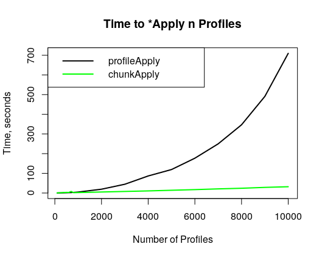

background-image: url(static/NRCS_General_-_November_2017_FINAL.jpg)
background-size: contain

<!--
Abstract:

Algorithms for Quantitative Pedology was designed to be a “toolkit for soil scientists.” The aqp R package provides functions that support data-driven tasks such as visualization, aggregation, and classification of soil profiles. The code is open-source and under active development by members of the National Cooperative Soil Survey (https://github.com/ncss-tech/aqp). The aqp project is an example of 10 years of continuity of analytical software development by volunteers and government employees.

Recent additions to the package include new functionality for working with groups and portions of profiles. Major changes have been made to the structure of the SoilProfileCollection object, iteration (profileApply), filtering (filter) and sub-setting ([[, glom, split/union). For iteration over large (n > 10,000) collections of soil profiles, optimizations have yielded over an order of magnitude decrease in processing time relative to earlier versions (pre-1.18.5), bringing larger analyses within reach. New “verbs” simplify syntax: allowing users to answer their pedologic questions with fewer intermediate steps and lines of code. These enhancements provide a basis for new functions that use horizon attributes to estimate U.S. Soil Taxonomy criteria, diagnostic features, and more.

With pedon and component data obtained from the soilDB R package (https://github.com/ncss-tech/soilDB) and other sources, new aqp functions can be used to increase efficiency of quality control on soil survey data, for evaluation of taxonomic structures, as well as for testing of new criteria. The automated estimation of taxonomic criteria has been successfully applied in review of 2020 NCSS Regional Standards and Taxonomy Committee Proposals as well as for routine soil survey applications in the Southwest Soil Survey Region.
-->

```{r setup, echo = FALSE}
knitr::opts_chunk$set(fig.retina = 3, warning = FALSE, message = FALSE)
```
<br><br><br>

.pull-left[##<font color="black">Expanding the 'Toolkit for Soil Scientists'</font>
### The <code>aqp</code> <b>R</b> package.

#### SSSA 2020 -- Big Data with Soil Survey, Capacity Building]


.right[.large[<br><br><br><br><br><br><br>Andrew G. Brown<br>Dylan E. Beaudette</b><br>
<a href="mailto:andrew.g.brown@usda.gov"><i class="fa fa-paper-plane fa-fw"></i>&nbsp;andrew.g.brown@usda.gov</a><br>
<a href="http://github.com/brownag"><i class="fa fa-github fa-fw"></i>&nbsp;brownag</a><br>
<a href="http://twitter.com/humus_rocks"><i class="fa fa-twitter fa-fw"></i>&nbsp;@humus_rocks</a>]]

---

.left-column[<br><br>

]

.right-column[

The {aqp} **R** package provides functions that support data-driven tasks such as visualization, aggregation, and classification of soil profiles. 

Project Homepage:

 - http://ncss-tech.github.io/AQP

{aqp} on CRAN (_stable_):

 - http://cran.r-project.org/web/packages/aqp/index.html

{aqp} on GitHub (_development_): 

 - http://github.com/ncss-tech/aqp

]

---

# {aqp} soil data inputs

There are several sample soil profile datasets provided in the {aqp} package. For the next few introductory slides, we use sample data #4: CA Serpentine Soils (McGahan et al., 2009)

```{r, message=FALSE}
library(aqp) # load aqp package

data(sp4, package = "aqp") # see ?sp4 for metadata
```

```{r echo=FALSE}
# hide this
sp4$ex_Ca_to_Mg <- NULL
```
--
### Optional: use `data.table` or `tibble`!
```{r}
sp4 <- data.table::as.data.table(sp4)
sp4 <- tibble::as_tibble(sp4)
sp4
```

??? 

You probably have data with a similar structure lying around on your hard drive. Why not try some of the following routines with your own data? We also welcome contributions of datasets that demonstrate interesting pedogenic concepts! Contact me or Dylan if interested.
---

# {aqp} _SoilProfileCollection_

```{r}
class(sp4)
```

"Promote" _data.frame_-like horizon data to a _SoilProfileCollection_ object.

```{r}
depths(sp4) <- id ~ top + bottom # specify site ID, top and bottom depth #<<

class(sp4) # sp4 promoted from tbl_df -> SoilProfileCollection

profile_id(sp4) # view profile IDs
```

???

You can promote data.frame-like objects containing horizon data to SoilProfileCollection objects. Unique layers are distinguished by the combination of site `id` and `top` depth. A brand new feature is the ability to use {data.table} and {tibble} data.frame subclasses inside SoilProfileCollection objects. This allows for faster subset operations and joins {data.table} as well as enhanced compatibility with {tidyverse} workflows and/or user-preferred packages.
---

# {aqp} S4 methods (basics)

.pull-left[
#### `site`,SoilProfileCollection-method
```{r}
site(sp4) # "site" data
```

]

.pull-right[

#### `horizons`,SoilProfileCollection-method
```{r, eval=FALSE}
horizons(sp4) # "horizon" data
```

#### `plot`,SoilProfileCollection-method
```{r, fig.width=12} 
plot(sp4, 
     color = 'clay', 
     cex.names = 1)
```
]

???

The site and horizons methods provide access to the S4 site and horizon slots within the SoilProfileCollection object.

A major feature of aqp and the SoilProfileCollection are the plot methods. These provide a rapid way to visualize geometric and tabular data from a set of soil profiles. Here, we are viewing all profiles in the `sp4` SoilProfileCollection object, with the thematic attribute "clay" (% clay content). The default arguments of `plot` often need to be adjusted for figures containing very small or very large numbers of profiles. For better readability, we use a larger-than-default character expansion value for the labels.
---

# {aqp} S4 methods (subset)

#### `[`,SoilProfileCollection-method
```{r, eval=FALSE}
sp4[1:2,] # i-index: first two profiles 
```

```{r}
sp4[,1:2] # j-index: first two horizons (of each profile!)
```

---
# {aqp} S4 methods (accessors)

#### `$` and `[[`,SoilProfileCollection-methods
```{r}
sp4$clay       # get clay data 
sp4[["clay"]]  # using expression for name, not symbol
```
---
# {aqp} S4 methods (setters)

#### `$<-` and `[[<-`,SoilProfileCollection-methods
```{r}
sp4$ex_Ca_to_Mg      <- sp4$Ca / sp4$Mg # calculate Ca:Mg ratio 
sp4[["ex_Ca_to_Mg"]] <- sp4$Ca / sp4$Mg # "
```

#### Initialize a new column with a singleton
```{r}
site(sp4)$new_var <- 2 
length(sp4$new_var)

horizons(sp4)$new_hz_var <- 3 
length(sp4$new_hz_var)
```

#### Remove a column 
```{r}
site(sp4)$new_var <- NULL 
```
---

# {aqp} S4 methods (joins)

#### `site<-`,SoilProfileCollection-method
```{r}
site(sp4) <- data.frame(id = c("mariposa","mendocino"), site_grp = "ingroup") #<<
head(site(sp4), 5)
```

#### `horizons<-`,SoilProfileCollection-method
```{r}
horizons(sp4) <- data.frame(id = c("mariposa","mendocino"), hz_grp = "group") #<<

table(horizons(sp4)$hz_grp, useNA = "ifany")
```

---
# {aqp} S4 methods (filtering)

`filter` and other new {dplyr}-like verbs in {aqp} use {rlang} for non-standard evaluation. This results in less typing and easier to read code!

```{r}
# site property
subsp4 <- filter(sp4, id %in% c("colusa","mariposa","shasta")) #<<
subsp4
```
---
# {aqp} S4 methods (filtering)

Horizon-level filtering uses `ANY` not `ALL` logic. You can mix site and horizon level logic. Use the `greedy` argument to toggle the _union_ versus _intersection_ of site/horizon matches.

```{r}
# horizon properties (two simultaneous logical expressions)
subsp4 <- filter(sp4, clay > 30, ex_Ca_to_Mg < 0.05) #<<
subsp4
```

---
# {aqp} iteration

```{r}
f <- profileApply(sp4, estimateSoilDepth)
```
--

With recent internal optimizations, `profileApply` now scales much better to larger collections.



???

"Use `profileApply` to apply a function to each profile in a _SoilProfileCollection_, like base **R** `*apply`. You can use the `simplify` and `frameify` arguments to change the result object type."

---
# {aqp} split (SPC -> list)

```{r}
f <- aqp::split(sp4, f = idname(sp4))
str(f, max.level = 1)
f[[1]]
```
---

# {aqp} union (list -> SPC)
```{r}
sp4 <- aqp::union(f)
sp4
```
---
# {aqp} `%>%` (pipe operator)

Many new methods in {aqp} take a _SoilProfileCollection_ as first argument, and return a _SoilProfileCollection_. Use {magrittr} pipes `%>%` to decrease development time and improve readability. 

```{r, eval=FALSE}
f(x, y) == x %>% f(y) #<<
```

```{r plot-last, fig.show = 'hide'}
library(magrittr)

sp4 %>%
  trunc(0, 15) %>%
  aqp::mutate(thk = bottom - top) %>%
  mutate_profile(dwt = thk / sum(thk),
                 dwt_Ca = sum(Ca * dwt)) %>%
  plot(plot.order = order(.$dwt_Ca), color = "Ca", cex.names = 1)
```
--
```{r ref.label = 'plot-last', echo = FALSE, fig.width=12, fig.height=3.5}
# reveal plot below after explaining code
```

# Who are we?
background-image: url(static/NRCS_General_-_November_2017_FINAL_regular.jpg)
background-size: contain

.pull-left[

]

.pull-right[
#### Andrew G. Brown
 - TODO
]
