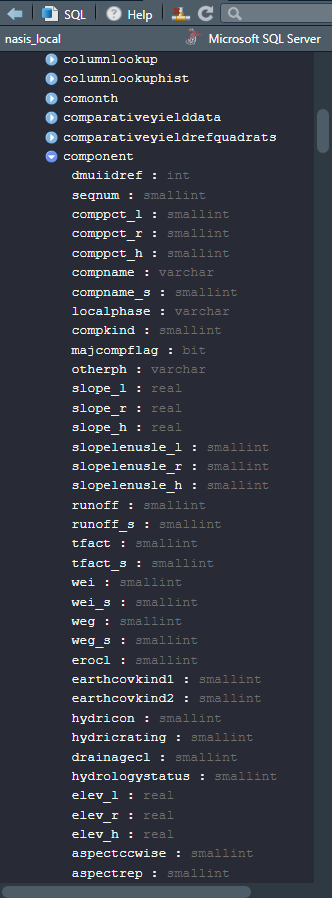
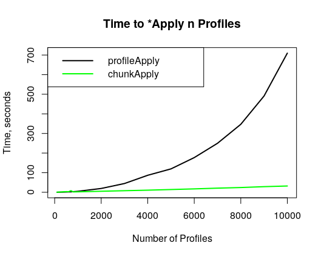

class: titleSlide

<!--
Abstract:

Algorithms for Quantitative Pedology was designed to be a “toolkit for soil scientists.” The aqp R package provides functions that support data-driven tasks such as visualization, aggregation, and classification of soil profiles. The code is open-source and under active development by members of the National Cooperative Soil Survey (https://github.com/ncss-tech/aqp). The aqp project is an example of 10 years of continuity of analytical software development by volunteers and government employees.

Recent additions to the package include new functionality for working with groups and portions of profiles. Major changes have been made to the structure of the SoilProfileCollection object, iteration (profileApply), filtering (filter) and sub-setting ([[, glom, split/combine). For iteration over large (n > 10,000) collections of soil profiles, optimizations have yielded over an order of magnitude decrease in processing time relative to earlier versions (pre-1.18.5), bringing larger analyses within reach. New “verbs” simplify syntax: allowing users to answer their pedologic questions with fewer intermediate steps and lines of code. These enhancements provide a basis for new functions that use horizon attributes to estimate U.S. Soil Taxonomy criteria, diagnostic features, and more.

With pedon and component data obtained from the soilDB R package (https://github.com/ncss-tech/soilDB) and other sources, new aqp functions can be used to increase efficiency of quality control on soil survey data, for evaluation of taxonomic structures, as well as for testing of new criteria. The automated estimation of taxonomic criteria has been successfully applied in review of 2020 NCSS Regional Standards and Taxonomy Committee Proposals as well as for routine soil survey applications in the Southwest Soil Survey Region.
-->

```{r setup, echo = FALSE}
knitr::opts_chunk$set(fig.retina = 3, warning = FALSE, message = FALSE)
```
<br><br><br>

.pull-left[##<font color="black">Expanding the Toolkit for Soil Scientists</font>
### The _Algorithms for Quantitative Pedology_ {`aqp`}<br>**R** package

#### SSSA 2020 &mdash; Virtual Meeting<br>Big Data with Soil Survey,<br>Capacity Building
]

.right[.large[<br><br><br><br><br><br><br><br>
Andrew G. Brown<br>
<a href="mailto:andrew.g.brown@usda.gov">`r icon::fa("mail-bulk")`&nbsp;andrew.g.brown@usda.gov</a>
<br><br>
Dylan E. Beaudette</b><br>
<a href="mailto:dylan.beaudette@usda.gov">`r icon::fa("mail-bulk")`&nbsp;dylan.beaudette@usda.gov</a><br><br>

<!--<a href="http://github.com/brownag">`r icon::fa("github")`&nbsp;brownag</a><br>
<a href="http://twitter.com/humus_rocks">`r icon::fa("twitter")`&nbsp;@humus_rocks</a>
-->
]]
 
---
class: bodySlide
<br>
## The {`aqp`} **R** package
.left-column[

[](https://www.r-project.org/)

<br>

[](http://ncss-tech.github.io/aqp/)

]

.right-column[

 [**R**](https://www.r-project.org/) is a freely available language and environment for statistical computing and graphics.

 The {`aqp`} **R** package provides functions to support data-driven tasks such as visualization, aggregation, and classification of soil profiles. The code is open-source and under active development by members of the National Cooperative Soil Survey.

Project Homepage: http://ncss-tech.github.io/AQP/

{`aqp`} on Comprehensive R Archive Network (CRAN; _stable_)

 - http://cran.r-project.org/web/packages/aqp/

{`aqp`} on GitHub (_development_): 

 - http://github.com/ncss-tech/aqp/

]

???

.:. Explain the {`packagename`} notation. Explain GNU S, R and CRAN. Explain GitHub.


---
class: bodySlide
<br>
## Soil Data Inputs

.left-column[

] 

&nbsp;&nbsp;&nbsp;You can load data from any source that <b>R</b> supports!
<br><br> 
&nbsp;&nbsp;&nbsp;The {`soilDB`} package has several ways to get soil data!

.right-column[- `fetchSDA`, `fetchSDA_spatial`, `SDA_query` & `SDA_spatialQuery` for [SSURGO](https://www.nrcs.usda.gov/wps/portal/nrcs/detail/soils/survey/geo/?cid=nrcs142p2_053627) from [Soil Data Access](https://sdmdataaccess.nrcs.usda.gov) (SDA)

- `fetchKSSL` for querying a snapshot of the [Kellogg Soil Survey Laboratory](https://ncsslabdatamart.sc.egov.usda.gov/) (KSSL) database
 
- `fetchOSD` for series type location profiles and narratives from [Official Series Descriptions](https://soilseries.sc.egov.usda.gov/osdquery.aspx) (OSDs)
 
- `fetchNASIS` for [NASIS](https://www.nrcs.usda.gov/wps/portal/nrcs/detail/soils/survey/tools/?cid=nrcs142p2_053552) pedons / components from a<br>local database]

???

{`soilDB`} uses {`aqp`} for the _SoilProfileCollection_ object. While aqp is intended to be generic, much of the focus of our development has been around dealing with data generated by the National Cooperative Soil Survey program.

---
class: bodySlide
<br>
## {`aqp`} SoilProfileCollection

```{r, message=FALSE}
library(aqp) # load aqp package

# load sample dataset CA serpentinite Soils 
# (McGahan et al., 2009)
data(sp4, package = "aqp") # see ?sp4 for metadata
```

--

```{r}
head(sp4, n = 8)
```

```{r echo=FALSE}
# hide this
sp4$ex_Ca_to_Mg <- NULL
```

???

There are several sample soil profile datasets provided in the {`aqp`} package. Some are simple tables, others are _SoilProfileCollection_ objects. For the next few introductory slides, we use sample data #4: CA Serpentine Soils (McGahan et al., 2009)

---
class: bodySlide
<br>
### Optional: use `data.table` or `tibble`!
```{r}
sp4 <- data.table::as.data.table(sp4)
head(sp4)
```

--

```{r, eval=FALSE}
sp4 <- tibble::as_tibble(sp4)
head(sp4)
```

```{r, echo=FALSE}
sp4 <- tibble::as_tibble(sp4)
head(sp4[,-((length(colnames(sp4))-1):length(colnames(sp4))) ])
```
---
class: bodySlide
<br>
## {`aqp`} Methods (basics)

#### "Promote" _data.frame_-like horizon data to a _SoilProfileCollection_ (SPC) object.

```{r}
class(sp4)
```

--

```{r}
depths(sp4) <- id ~ top + bottom # specify site ID, top and bottom depth #<<
```

--

```{r}
class(sp4) # sp4 promoted from tbl_df -> SoilProfileCollection
```

--

```{r}
str(profile_id(sp4), vec.len = 3) # view first 3 profile IDs
```

???

You can promote data.frame-like objects containing horizon data to _SoilProfileCollection_ objects. Unique layers are distinguished by the combination of site `id` and `top` depth. A brand new feature is the ability to use {data.table} and {tibble} data.frame subclasses inside SoilProfileCollection objects. This allows for faster subset operations and joins {data.table} as well as enhanced compatibility with {tidyverse} workflows and/or user-preferred packages.
---
class: bodySlide
<br>
## {`aqp`} Methods (site data)


.pull-left[

### `plot`
```{r, fig.width=12} 
plot(sp4, # plot % clay content
     color = 'clay', 
     id.style = 'side',
     cex.names = 1)
```

]

--

.pull-right[
### `site`
```{r}
site(sp4) # "site" data
```
]


---
class: bodySlideLite
<br>
## {`aqp`} Methods (horizon data)

### `horizons`
```{r}
horizons(sp4) # "horizon" data
```

???
Explain S4.

The site and horizons methods provide access to the S4 site and horizon slots within the _SoilProfileCollection_ object.

A major feature of aqp and the _SoilProfileCollection_ are the plot methods. These provide a rapid way to visualize geometric and tabular data from a set of soil profiles. Here, we are viewing all profiles in the `sp4` _SoilProfileCollection_ object, with the thematic attribute "clay" (% clay content). The default arguments of `plot` often need to be adjusted for figures containing very small or very large numbers of profiles. For better readability, we use a larger-than-default character expansion value for the labels.

---
class: bodySlideLite
<br>
## {`aqp`} Methods (extract)

### `[i,]`
```{r, highlight.output=c(1,5,16)}
sp4[1:2,] # i-index: first two profiles 
```

---
class: bodySlideLite
<br>
## {`aqp`} Methods (extract)

### `[i,]`
```{r, eval=FALSE}
sp4[1:2,] # i-index: first two profiles 
```

### `[,j]`
```{r, highlight.output=c(1,5,16)}
sp4[,1:2] # j-index: first two horizons (of each profile!)
```

---
class: bodySlide
<br>
## {`aqp`} Methods (accessors)

### `$`
```{r}
sp4$clay       # get clay data 
```

--
### `[[`

```{r}
sp4[["clay"]]  # using expression for name, not symbol
```

---

class: bodySlide
<br>
## {`aqp`} Methods (setters)

### `$<-` and `[[<-`
Calculate Ca:Mg ratio
```{r}
sp4$ex_Ca_to_Mg      <- sp4$Ca / sp4$Mg  

sp4[["ex_Ca_to_Mg"]] <- sp4$Ca / sp4$Mg 
```

--

Initialize a new column with a single value
```{r}
site(sp4)$new_var <- 2 
horizons(sp4)$new_hz_var <- 3 
```

--
.left-code[
```{r, eval = FALSE}
length(sp4$new_var) # 10 sites, 10 values
length(sp4$new_hz_var) # 30 horizons, 30 values
sp4$new_var <- NULL # remove a column
```
]
???
You can use the dollar sign method along with either site or horizons method to set a column for all sites or all horizons to the same value. 

Only profile ID is shared between site and horizon tables, so when removing a column, there is no need to specify site or horizons.

---
class: bodySlideLite
<br>
## {`aqp`} Methods (subset)

`subset` is the {`aqp`} method for extracting profiles that meet certain logical criteria at the site or horizon level. 

```{r} 
# site property filtering, using base 
sub.sp4 <- subset(sp4, id %in% c("colusa","mariposa","shasta")) #<<
```

--

```{r}
#   or dplyr-like syntax: filter
sub.sp4 <- filter(sp4, id %in% c("colusa","mariposa","shasta")) #<<
```

--

```{r, highlight.output=c(1,5,16)}
sub.sp4
```

???

An alias for `subset` is `filter` and other new {dplyr}-like verbs in {`aqp`} use {rlang} for non-standard evaluation. This results in less typing and easier to read code!

---
class: bodySlideLite
<br>
## {`aqp`} Methods (subset)

```{r, highlight.output=c(1,5,17)}
# horizon properties (two simultaneous logical expressions)
sub.sp4 <- subset(sp4, clay > 30, ex_Ca_to_Mg < 0.05) #<<
sub.sp4
```

???

You can mix site and horizon level logic. Horizon-level filtering uses `ANY` not `ALL` logic. Use the `greedy` argument to toggle the _union_ versus _intersection_ of site/horizon matches.

---
class: bodySlideLite
<br>
## {`aqp`} Methods (split SPC -> list)

If you need to operate on groups, splitting into `list` is a good option.

```{r}
a.list <- split(sp4, f = idname(sp4))
```  

```{r}
str(a.list, max.level = 1)
```

---
class: bodySlideNOBR
<br>
## {`aqp`} Methods (split SPC -> list)

If you need to operate on groups, splitting into `list` is a good option.

```{r, eval=FALSE}
a.list <- split(sp4, f = idname(sp4))
```

```{r, eval=FALSE}
str(a.list, max.level = 1)
```

```{r, highlight.output=c(1,5,14)}
a.list[[1]]
```

---
class: bodySlide
<br>
## {`aqp`} Methods (iteration)

```{r}
sub.sp4$soil_depth <- profileApply(sub.sp4, estimateSoilDepth)
sub.sp4$soil_depth
```

--

```{r, highlight.output=c(2)}
profileApply(sp4, frameify = TRUE, 
    function(p) {
      data.frame(id = profile_id(p), 
                 soil_depth = estimateSoilDepth(p))
    })
```
???

`profileApply` is the {aqp} analogue of the base R `*apply` functions, only it iterates over profiles rather than e.g. list elements for `lapply`.

--- 
class: bodySlide
<br>
## {`aqp`} Methods (iteration)

With recent internal optimizations, `profileApply` scales to larger collections.



???

"Use `profileApply` to apply a function to each profile in a _SoilProfileCollection_, like base **R** `*apply`. You can use the `simplify` and `frameify` arguments to change the result object type."

`profileApply` is used internally by other methods like `glomApply` and `mutate_profile`

---
class: bodySlide
<br>
## {`aqp`} Methods (`combine`; list -> SPC)

Recombine list elements into "original" SoilProfileCollection with `combine`
.left-code-slight[
```{r, highlight.output=c(1,5,17)}
combine(a.list)
```
]

---
class: bodySlide
<br>
## {`aqp`} `%>%` (pipes)

Use {magrittr} "pipes" (`%>%` infix operator) to chain operations.

```{r, eval=FALSE}
f(x, y) == x %>% f(y) #<<
```

```{r, echo = FALSE}
library(magrittr)
```

--

```{r, eval=FALSE}
your.data2 <- operation1(your.data, argument1, argument2)
result <- operation1(your.data2, argument3, argument4)
```

becomes...

```{r, eval=FALSE}
result <- your.data %>%
            operation1(argument1, argument2) %>%
            operation2(argument3, argument4)
```

---
class: bodySlideLite
<br>
## {`aqp`} `%>%` (pipes)

1. Truncate all profiles to 0 - 15 cm interval

2. Calculate NH4OAc (pH 7) Ca (0 - 15 cm depth-weighted average cmol/kg)

3. Plot horizon-level values, in order of increasing site-level average

--

```{r, echo=FALSE}
par(mar=c(0,0,0,0))
```

```{r plot-Ca, fig.show = 'hide'}
sp4 %>%
  trunc(0, 15) %>% 
  mutate_profile(dwt = bottom - top / sum(bottom - top), 
                 dwt_Ca = sum(Ca * dwt)) %>% 
  plot(plot.order = order(.$dwt_Ca), color = "Ca", cex.names = 1)
```

--

```{r ref.label = 'plot-Ca', echo = FALSE, fig.width=15, fig.height=3.5}
```

???

Many new methods in {`aqp`} take a _SoilProfileCollection_ as first argument, and return a _SoilProfileCollection_. This is the model assumed/exploited by the {magrittr} pipe operator.

---
class: bodySlide
<br>
## {`aqp`} Methods (left joins)

### `site<-`

```{r}
site(sp4) <- data.frame(id = c("mariposa","mendocino"), #<<
                        site_grp = "ingroup") #<<
```

```{r}
head(site(sp4), 5)
```

<!-- table(site(sp4)$site_grp, useNA = "ifany") -->

---
class: bodySlide
<br>
## {`aqp`} Methods (left joins)
### `horizons<-`
```{r}
horizons(sp4) <- data.frame(id = c("mariposa","mendocino"), hz_grp = "group") #<<
h <- horizons(sp4)
```
.pull-left[
```{r}
h[5:14,c(idname(sp4),"hz_grp")]
```
]
.pull-right[
```{r}
table(h$hz_grp, useNA = "ifany")
```
]

---
class: bodySlide
<br>
## {`aqp`} Soil Color
.pull-left[
```{r plot-Tama, echo=FALSE, fig.width=10, fig.height=7}
par(mar = c(3, 1, 0, 3))
# library(soilDB)
# tama <- fetchKSSL(series = "tama", 
#                   returnMorphologicData = TRUE, 
#                   simplifyColors = TRUE)
# save(tama, file="img/tama.Rda")

load(file="img/tama.Rda")
tama$SPC$is_mollic_color <- hasDarkColors(tama$SPC, d_value = NA)
horizons(tama$SPC)$is_mollic_mask <- rgb(0,0,0)
horizons(tama$SPC)$is_mollic_mask[!tama$SPC$is_mollic_color] <- rgb(1,1,1)

tama2 <- harmonize(tama$SPC, list(mollic = list(moist_color = "moist_soil_color", 
                                                is_mollic_color = "is_mollic_mask")))

groupedProfilePlot(tama2[11:14,], name.style = "left-center",
                   groups = "hgroup", color = "mollic", 
                   cex.names = 1.4, group.name.cex = 1.4)
```
]

.pull-right[
.center[#### {`aqp`} has methods for soil data in<br>Munsell, sRGB and CIELAB.]
`aggregateColor`,
`colorContrast`,
`colorQuantiles`,
`contrastChart`,
`contrastClass`,
`getClosestMunsellChip`,
`hasDarkColors`,
`horizonColorIndices`,
`huePosition`,
`rgb2munsell`,
`munsell2rgb`,
`munsell2spc`,
`parseMunsell`,
`previewColors`,
`soilColorSignature`,
`soilPalette`
]

---
class: bodySlide
<br>
## {`aqp`} Soil Color Opinions

.pull-left[
```{r} 
n <- 8
hues <- c('10YR','7.5YR','2.5Y')
# hue
hh <- sample(hues, size = n, 
             replace = TRUE, 
             prob = c(0.7,0.2,0.1))
# value
vv <- sample(3:6, size = n, 
             replace = TRUE)

# chroma
cc <- sample(c(3,4,6), size = n, 
             replace = TRUE)
```
]
.pull-right[
```{r}
# reference soil color
m1 <- rep('10YR 4/4',
          times = n)

# opinions of soil color
m2 <- sprintf('%s %s/%s', 
              hh, vv, cc)

# color contrast via dE00
cc <- colorContrast(m1, m2)

# re-order opinions
o <- order(cc$dE00)
m2 <- m2[o]
```
]

---
class: bodySlide
<br>

```{r plot-Contrast}
colorContrastPlot(m1, m2, 
                  labels = c('reference', 'opinions'), 
                  d.cex = 0.8, col.cex = 0.8)
```

---
class: bodySlideLite
<br>
## {`aqp`} Soil Taxonomy & Classification

{`aqp`} has many functions that employ heuristics about horizon designations, geometry, and diagnostic properties.
 
```{r, echo=FALSE,fig.width=12,fig.height=5}
par(mar=c(0,0,0,5))
load("img/mollicthk.Rda")
s.sub@horizons[11,]$soil_color <- munsell2rgb("10YR", 2, 1)
s.sub@diagnostic[6,]$top <- 7
s.sub@diagnostic[6,]$bottom <- 32
plotSPC(s.sub, label = "criteria", axis.line.offset = -3.5, cex.names = 1.1, id.style = "top",
        name.style = "left-center")
addDiagnosticBracket(s.sub, kind = 'particle size control section', lwd=3)
addDiagnosticBracket(s.sub, kind = 'minimum mollic/umbric thickness', lwd=3,
                     offset=0, tick.length=0, col="green")
abline(h=c(18+0.5,25+0.5,54+0.5,75+0.5), lty=2)

#mtext("aqp calculated\nMollic/Umbric Minimum Thickness Requirement\n& Particle Size Control Section Boundaries", 3)
legend("bottomleft", c("particle size control section",
                       "minimum mollic/umbric thickness",
                       "absolute depths: 18, 25, 54, 75 cm"), lwd=c(3,3,1), lty=c(1,1,2),
       col=c("black","green","black"))
```

???

`estimateSoilDepth`, `estimatePSCS`, `getArgillicBounds`, `getCambicBounds`, `getMineralSoilSurfaceDepth`, `getPlowLayerDepth`, `getSoilDepthClass`, `getSurfaceHorizonDepth`, `hasDarkColors` ... and more!

See my other talk in Future of Pedology Symposium regarding the types of work that have been done here.

---
class: bodySlide
<br>
## Thank you for your attention!
.left-column[
<br>

<br>


]

.right-column[
#### Andrew G. Brown, Soil Scientist, MLRA Soil Survey Office, Sonora, CA
 
<a href="mailto:andrew.g.brown@usda.gov">`r icon::fa("mail-bulk")`&nbsp;andrew.g.brown@usda.gov</a><br>
<a href="http://github.com/brownag">`r icon::fa("github")`&nbsp;brownag</a><br>
<a href="http://twitter.com/humus_rocks">`r icon::fa("twitter")`&nbsp;@humus_rocks</a>

#### Dylan E. Beaudette, Soil Scientist, National Soil Survey Center (duty station: Sonora, CA)

<a href="mailto:dylan.beaudette@usda.gov">`r icon::fa("mail-bulk")`&nbsp;dylan.beaudette@usda.gov</a><br>
<a href="http://github.com/dylanbeaudette">`r icon::fa("github")`&nbsp;dylanbeaudette</a><br>
<a href="http://twitter.com/dylanbeaudette">`r icon::fa("twitter")`&nbsp;@dylanbeaudette</a>

]

_USDA is an equal opportunity provider, employer, and lender._

---
class: bodySlide
<br>

## References

Beaudette, D.E., Roudier P., and A.T. O'Geen. 2013. Algorithms for Quantitative Pedology: A
Toolkit for Soil Scientists. Computers & Geosciences. 52:258 - 268.

McGahan, D.G., Southard, R.J, Claassen, V.P. 2009. Plant-Available Calcium Varies Widely in Soils on Serpentinite Landscapes. Soil Sci. Soc. Am. J. 73: 2087-2095.

Pedersen, T.L., B. Nicolae, and R. François 2020. farver: High Performance Colour Space Manipulation. R package version 2.0.3. https://CRAN.R-project.org/package=farver

R Core Team. 2020. R: A language and environment for statistical computing. R Foundation for
Statistical Computing, Vienna, Austria. URL https://www.R-project.org/.

Xie, Y. 2020. xaringan: Presentation Ninja. R package version 0.17.1. https://github.com/yihui/xaringan

.bottom[Slides: https://github.com/brownag/SSSA2020]
